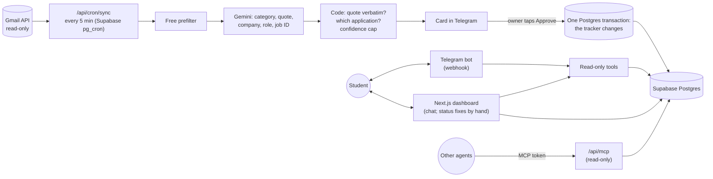

# Job Hunt Tracker

An AI agent that keeps a student's job applications up to date from their Gmail. It reads job emails (confirmations, online assessments, interviews, rejections, offers), proposes each status change in Telegram with the exact sentence that justifies it, and changes nothing until the student taps **Approve**.

- **Live:** https://home-assignment-henna.vercel.app
- **Telegram bot:** [@jobapplicationtracker1907bot](https://t.me/jobapplicationtracker1907bot)
- **Why it's built this way:** [DECISIONS.md](DECISIONS.md) (assumptions, cost, budget, MCP, build log, where AI helped and where it was wrong, evals)

## For reviewers: try it in two minutes

No Gmail needed: the demo loads a sample inbox into your own account and the real agent reads it.

1. Open **https://t.me/jobapplicationtracker1907bot?start=demo** (or "Try it with sample emails" on the website) and tap **Start**.
2. The bot loads 11 fictional emails (job emails, a newsletter, a job alert) and reads them with the same AI and checks as real mail (about 30 seconds). Then a summary: *6 updates from 5 companies*.
3. Tap **▶️ Start review**. Each card shows the change, why, the sentence from the email it relies on, the sender, the date and how confident the agent is. Tap **✅ Approve**, **❌ Reject** or **⏭ Later**.
4. After the last card, tap **📨 Simulate a new email**: an email "arrives" and its card pops up, as it would from Gmail. Five scripted emails cover an interview, a job-ID match between two roles at one company, a rejection, a *"Which application is this?"* and an offer.
5. Ask anything in plain words: *"which applications haven't replied?"*, *"what happened with Lumen Health?"*. Answers come from your tracker and say where they came from.
6. Send **/dashboard** for a one-time sign-in link to the website (it asks you to continue as yourself): the pipeline, each application's timeline with the evidence, the AI budget, and **Ask the agent**, the same agent and the same conversation as in Telegram.
7. Optional, MCP: on the dashboard's **Developers** page, create a token and connect Claude Code, Cursor or the MCP Inspector. `generate_prep_brief` on Northwind Robotics, after its interview email, returns a grounded interview brief.
8. **/demo_reset** removes the samples. To use your real inbox, send **/connect** (read-only Gmail access). Google shows *"Google hasn't verified this app"*: the app is published but unverified, so choose **Advanced → Go to Job Hunt Tracker**.

### The action, and who approves it

- **The action:** creating or updating an application in your tracker (a status change, a new application, a job ID saved).
- **Who approves:** only the Telegram account that owns the tracker, by tapping **Approve** on that specific card in its private chat with the bot. As a tester, that's you, for your own tracker. One card is one change; there is no "approve all".
- **What's refused:** someone else's tap, a card older than 7 days, and a card whose application changed after it was made. Group chats are ignored.
- **What can't approve at all:** the agent never changes your tracker on its own, and other agents (MCP) can only read. On the website you can correct a status by hand when an email was missed; that's your own change, recorded as such, not an approval.

## What it does

- **Reads Gmail, read-only**, every 5 minutes (or on `/sync`). A free keyword and domain filter skips mail that can't be about an application; only the rest reaches the model.
- **Classifies each job email** with Gemini: category, company, role, job ID, the sentence that justifies it, and a confidence.
- **Checks the model in code:** the quoted sentence must be in the email word for word; the job ID too; the email is matched to an application by job ID, then company and role; confidence is capped when the match is weak. When several applications fit, the card asks which one.
- **Proposes in Telegram** and applies a change only on the owner's tap, in one database transaction.
- **First sync:** 60 days of past email become one summary, then one card at a time.
- **Answers questions** in Telegram and in the dashboard's chat, from the tracker, through read-only tools. It says so when the data can't answer. Both places share one conversation.
- **Dashboard:** the pipeline, a timeline per application with the evidence behind every status, the budget, and the chat. If the agent missed an email, you can correct a status by hand on the application's page.
- **MCP:** other agents can list applications and ask for a grounded interview or assessment brief. Read-only, scoped to the token's owner.
- **Monthly budget:** $5 of AI per person and $25 shared, checked before every model call, with Telegram notices at 80% and when it's used up.

## Architecture



One Next.js app on Vercel hosts the webhook, the cron endpoint, the MCP endpoint, the Google OAuth callback and the website. Stack and reasons: [DECISIONS.md §4](DECISIONS.md#4-stack-and-why).

| Folder | What's in it |
|---|---|
| `src/app` | Pages (landing, dashboard, legal) and API routes (`api/telegram/webhook`, `api/cron/sync`, `api/mcp`, `api/gmail/*`, `api/auth/login`, `api/health`) |
| `src/lib/agent` | Classification, quote and job-ID checks, matching, the chat (used by the bot and the dashboard) |
| `src/lib/proposals` | Proposal rules, cards, approval, the past-email review |
| `src/lib/gmail`, `src/lib/telegram` | Sync and prefilter; the bot and every message it sends |
| `src/lib/llm` | The Gemini client, prices, the budget |
| `src/lib/mcp`, `src/lib/demo` | MCP tools and tokens; the sample inbox |
| `prisma/` | Schema and migrations |
| `evals/`, `scripts/` | Evals; bot setup and local polling |

## Run it locally

You need Node 20+, a Supabase project, a Telegram bot, a Google Cloud OAuth client with the Gmail API, and a Gemini API key (setup below).

```bash
npm install
cp .env.example .env.local   # fill it in: see "Environment variables"
npm run db:deploy            # apply the migrations
npm run dev                  # http://localhost:3000
npm run bot:dev              # the bot, by long polling (it refuses while a webhook is set)
```

To open the local dashboard, run `npm run dev:login`: it prints a one-time sign-in link for `localhost` (as the admin, or `npm run dev:login -- <telegram id>`). The deployed bot's `/dashboard` always links to the deployed site. When the bot itself runs locally, `/dashboard` and `/connect` put their link in the message text, because Telegram only accepts https links in buttons.

## Deploy

This is how the live instance is deployed.

1. **Supabase.** Create a project (this one is in us-east-1). Set `DATABASE_URL` to the transaction pooler (port 6543) and `DIRECT_URL` to the session pooler (port 5432), then run `npm run db:deploy`. The migrations also turn on row-level security and remove the public API's access to every table.
2. **Google Cloud.**
   - Enable the Gmail API.
   - Set up the OAuth consent screen (External) with the scope `gmail.readonly`, the app's home page and its privacy page (`/privacy`), then **publish it to production**. In "Testing", Gmail access expires after 7 days.
   - Create an OAuth client (Web application) with the redirect URI `<APP_URL>/api/gmail/callback`.
3. **Gemini.** Create an API key in a billed project. On the paid tier, email content isn't used to improve Google's products.
4. **Telegram.** Create the bot with BotFather.
5. **Vercel.**
   - Import the repository and set the environment variables below. `APP_URL` is the deployment's address; this one runs in the Washington, D.C. region, next to the database.
   - Deploy.
   - Point Telegram at it: `APP_URL=https://<your-app> npm run bot:setup -- --webhook`. This sets the command menu and the webhook with its secret.
6. **The 5-minute sync.** Vercel's free plan runs scheduled jobs once a day, so Supabase calls the app instead.
   - Enable the `pg_cron` and `pg_net` extensions.
   - Run the SQL below in the SQL editor, with your `CRON_SECRET` pasted in. The secret goes into Supabase Vault, not the job's text.

   ```sql
   select vault.create_secret('<CRON_SECRET>', 'job_hunt_cron_secret');
   select vault.create_secret('https://<your-app>/api/cron/sync', 'job_hunt_cron_url');
   select cron.schedule('job-hunt-sync', '*/5 * * * *', $$
     select net.http_post(
       url := (select decrypted_secret from vault.decrypted_secrets where name = 'job_hunt_cron_url'),
       headers := jsonb_build_object(
         'Authorization', 'Bearer ' || (select decrypted_secret from vault.decrypted_secrets where name = 'job_hunt_cron_secret'),
         'Content-Type', 'application/json'),
       body := '{}'::jsonb,
       timeout_milliseconds := 60000);
   $$);
   ```
   Five minutes later, `select status_code, content from net._http_response order by created desc limit 3;` should show `200`.
7. **Check.** `https://<your-app>/api/health` returns `{"ok":true,"db":"up",...}`; send `/start` to the bot.

## Environment variables

Names and formats are also in [`.env.example`](.env.example). Never commit real values; locally they live in `.env.local`.

| Variable | What it is |
|---|---|
| `DATABASE_URL` | Supabase transaction pooler URL (port 6543), used by the app |
| `DIRECT_URL` | Supabase session pooler URL (port 5432), used by migrations |
| `TELEGRAM_BOT_TOKEN` | From BotFather |
| `TELEGRAM_BOT_USERNAME` | The bot's username, without `@` (links and the landing page) |
| `TELEGRAM_WEBHOOK_SECRET` | Telegram sends it with every update; the webhook refuses requests without it |
| `ADMIN_TELEGRAM_USER_ID` | Your numeric Telegram id: the shared-budget notices and the dashboard's admin view |
| `APP_URL` | The app's public address (`https://…` in production) |
| `TOKEN_ENCRYPTION_KEY` | 32 random bytes, base64 (`openssl rand -base64 32`). Encrypts Gmail tokens: keep it as long as you keep the database |
| `SESSION_SECRET` | Random string. Signs sign-in links, sessions and short-lived links |
| `CRON_SECRET` | Random string. pg_cron sends it as a bearer token to `/api/cron/sync` |
| `GOOGLE_CLIENT_ID`, `GOOGLE_CLIENT_SECRET` | The OAuth client from Google Cloud |
| `GEMINI_API_KEY` | Gemini API key |
| `GEMINI_MODEL` | Optional. Default `gemini-3.5-flash-lite` |
| `GEMINI_FALLBACK_MODEL` | Optional. The lighter model for reading emails from 80% of a budget (default `gemini-3.1-flash-lite`; `none` turns it off) |
| `LLM_MONTHLY_BUDGET_USD` | Optional. The shared AI cap, evals included. Default 25 |
| `LLM_USER_MONTHLY_BUDGET_USD` | Optional. Each person's AI allowance. Default 5 |
| `LLM_DEBUG` | Optional. Logs the chat's tool rounds: names only, never content |

## Tests and evals

```bash
npm test                 # 98 unit tests, no network
npm run evals            # the 5 evals that make no model calls
npm run evals -- --all   # all 10, including the 5 that call the model (about $0.05)
```

The evals run against the database in `.env.local` with throwaway users that they delete. The ones with HTTP checks need the app running (`npm run dev`); otherwise those checks are skipped, and the runner says so.

| Eval | What it proves |
|---|---|
| `eval:approval` | Only the owner's tap changes data; double taps, stale and expired cards, and "which application?" without a choice are refused |
| `eval:review` | The first sync becomes one summary, then one card at a time; Later; live email isn't held |
| `eval:account` | `/disconnect` keeps the tracker; `/delete_my_data` erases one user and nobody else |
| `eval:budget` | Both caps, the 80% and used-up levels, notices sent once, calls refused before spending ($0) |
| `eval:dashboard` | Sign-in links work once; each user sees only their own data; cookie flags; log out |
| `eval:classifier` | 24 labelled emails: category, verbatim quote and job ID, including traps and a prompt injection |
| `eval:chat` | Answers checked against the data; "I don't have that"; refuses to change data |
| `eval:mcp` | Tokens, read-only tools, each token scoped to its owner, grounded briefs, a planted instruction ignored |
| `eval:demo` | The sample inbox through the real agent: exactly the expected cards, and the right application each time |
| `eval:bot` | The Telegram bot end to end, through its real handlers, with Telegram replaced by a recorder |

How they map to the brief's three kinds (an answer checked against the data, reasoning on a known case, a refusal): [DECISIONS.md §11](DECISIONS.md#11-evals).

## Limits

- **Google sign-in:** the app is published but unverified, so Google warns on the consent screen and allows up to 100 users.
- **Sync:** Gmail is polled every 5 minutes. Real-time push (Pub/Sub) is the next step.
- **Dashboard edits:** only the status, by hand. Roles, job IDs and new applications still come from emails.
- **One database:** local development and production share it.
- **Budget:** costs are our own count of the tokens the API reports. Two calls at the same moment can overshoot a cap by cents ([DECISIONS.md §7](DECISIONS.md#7-budget-two-hard-caps-and-what-happens-near-them)).
